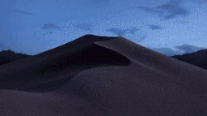
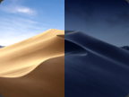
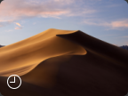

# Mojave on Linux



Use the beautiful wallpaper of **Mojave on Linux**.

It has two modes:

| Dark/Light                                                                                                                                        | Timed                                                                                                                          |
| ------------------------------------------------------------------------------------------------------------------------------------------------- | ------------------------------------------------------------------------------------------------------------------------------ |
|                                                                              |                                                                     |
| It will automatically change the wallpaper **based on the Dark Mode of your system**. Transitioning between 02 different phases of the wallpaper. | It will automatically change **based on the hour of your system**. Transitioning through 16 different phases of the wallpaper. |

**Table of Contents:**

- [Mojave on Linux](#mojave-on-linux)
  - [Installation](#installation)
  - [Uninstallation](#uninstallation)
  - [Credits](#credits)
  - [Troubleshooting](#troubleshooting)

## Installation

Follow these steps to install:

1. Clone this repository:

```bash
git clone https://github.com/lcgds/mojave-on-linux.git
```

2. Copy the Mojave files to your system:

```bash
sudo cp -r Mojave/ /usr/share/backgrounds/ && sudo cp Mojave.xml /usr/share/gnome-background-properties/
```

> :information_source: Notice \
> The command above requires elevated privileges, so the terminal will ask your password to authenticate.

3. Go to the 'Settings' of your system and apply the Mojave wallpaper.

## Uninstallation

To uninstall, do the following:

1. Delete the Mojave folder from your system:

```bash
sudo rm -r "/usr/share/backgrounds/Mojave/" && sudo rm /usr/share/gnome-background-properties/Mojave.xml
```

## Credits

This project was based on the [Mojave-Dynamic-Wallaper project](https://github.com/n3PH1lim/Mojave-Dynamic-Wallpaper). Many thanks to the [original author](https://github.com/n3PH1lim).

All images are from [© 2024 Apple Inc.](https://apps.apple.com/br/app/macos-mojave/id1398502828?mt=12)

The Mojave Image used in this docummentation came from the [Wiki Apple](https://apple.fandom.com/es/wiki/MacOS_Mojave).

## Troubleshooting

This project was last tested on Fedora 40.

If you find any errors, please report them in the [Issues Section](https://github.com/lcgds/mojave-on-linux/issues).
